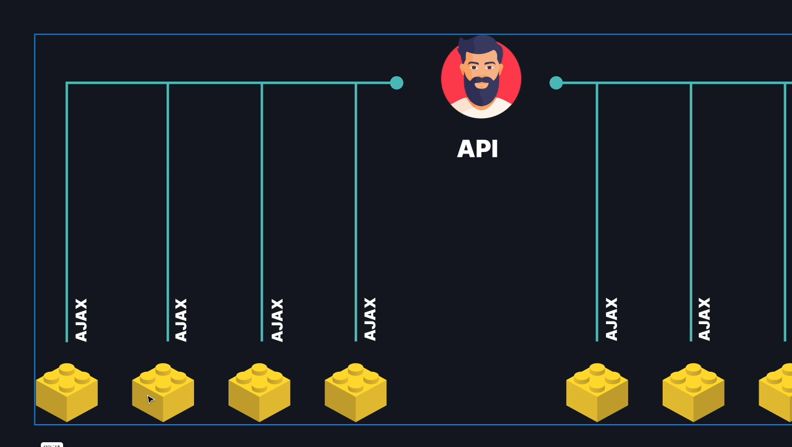

# Vue 3 + Vite

This template should help get you started developing with Vue 3 in Vite. The template uses Vue 3 `<script setup>` SFCs, check out the [script setup docs](https://v3.vuejs.org/api/sfc-script-setup.html#sfc-script-setup) to learn more.

## Recommended IDE Setup

- [VS Code](https://code.visualstudio.com/) + [Vue - Official](https://marketplace.visualstudio.com/items?itemName=Vue.volar) (previously Volar) and disable Vetur

-----------------------------------------------------

# Sobre o Pinia X Provide/Inject

- ## Exemplos de solicitações ajax sem o pinia:

- ## Exemplos de solicitações ajax com pinia:

# Porque usar o Pinia:

- ## Porque usar Pinia ao inves de usar o PROVIDE/INJECT do VUE;

- ## No caso abaixo, teria que passar do pai para o filho, via props e subir o evento, para cada componente filho;

- ## A solução para o caso acima é jogar tudo pro Pinia, e evitar passar essas propriedades para dentro de cada componente;

- ## Compartilhar dados entre componentes não parentes;

- ## A gente vai usar o Pinia e todos os componentes vão utilizar os dados do Pinia;

